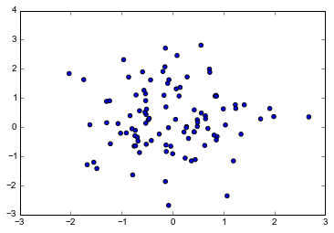
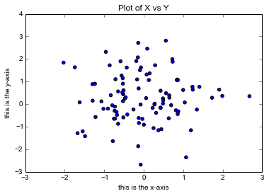
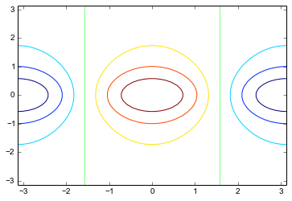
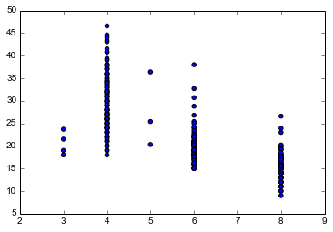
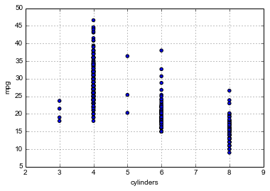
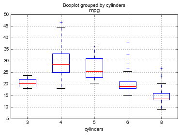
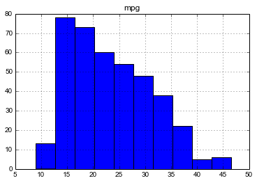
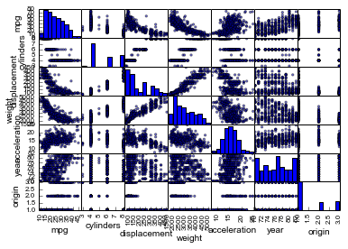

# Introduction to NumPy, SciPy, Pandas and scikit-learn
In ISLR, this lab is designed as an introduction to R language. Here, we will be
using Python and NumPy.

[NumPy](http://www.numpy.org/) is a package for scientific computing in
Python. It is mainly used for efficient computation on N-dimensional array
objects.

TODO: Add SciPy description here.

TODO: add Pandas description

TODO: add scikit-learn

TODO: add links to tutorials

## Basic commands

Let's start with creating vectors.

    import numpy as np
    x = np.array([1, 3, 2, 5])
    x

    array([1, 3, 2, 5])

    x = np.array([1, 6, 2])
    y = np.array([1, 4, 3])
    

    len(x)

    3

    len(y)

    3

    x + y

    array([ 2, 10,  5])

NumPy can be used to create multi-dimensional arrays (i.e. matrices).

    x = np.array([[1, 2], [3, 4]])
    x

    array([[1, 2],
           [3, 4]])

Some operations on the array,

    np.sqrt(x)

    array([[ 1.        ,  1.41421356],
           [ 1.73205081,  2.        ]])

    np.power(x, 2)

    array([[ 1,  4],
           [ 9, 16]])

To draw random samples from a normal (Gaussian) distribution

    x = np.random.normal(size=50)

Here we generate another set of random normal variables and compute the
correlation between them. For correlation, we use `scipy.stats.pearsonr`.

    y = x + np.random.normal(loc=50, scale=.1, size=50)
    from scipy import stats
    stats.pearsonr(x, y)

    (0.99375539257103218, 2.2177731085768871e-47)

Although, we generated `x` and `y` randomly from normal distributions, we
sometimes want to be able to reproduce the exact same values. For this purpose,
we can use `numpy.random.seed` function.

    np.random.seed(1303)
    np.random.normal(size=50)

    array([-0.03425693,  0.06035959,  0.45511859, -0.36593175, -1.6773304 ,
            0.5910023 ,  0.41090101,  0.46972388, -1.50462476, -0.70082238,
            1.43196963,  0.35474484,  1.67574682,  1.62741373,  0.27015354,
            0.15248539,  0.11593596,  0.89272237, -2.16627436,  0.26787192,
            0.36658207,  2.72335408,  0.44060293,  0.36036757,  0.38119264,
           -0.27845602,  1.73458476, -1.48138111, -0.47556927, -0.1932596 ,
            0.68115816, -0.05143463, -0.59151688,  0.02292374, -0.12259196,
            0.50633508,  0.63181139, -0.2443932 ,  0.39847385, -1.2716468 ,
            0.43167303, -1.36491646,  0.91004701,  0.65707308, -0.080445  ,
           -1.12057881, -1.31479423,  0.26394714, -0.59459381, -0.07624482])

Finally, the `mean` and `var` functions can be used to compute the mean and
variance of a vector of numbers.

    np.random.seed(3)
    y = np.random.normal(size=100)
    np.mean(y)

    -0.10863707440606224

    np.var(y)

    1.132081888283007

Applying `numpy.sqrt` gives the standard deviation.

    np.sqrt(np.var(y))

    1.0639933685333791

Alternatively, we can use `numpy.std` function.

    np.std(y)

    1.0639933685333791

## Graphics

[matplotlib](http://matplotlib.org/) is the _de facto_ standard plotting library
for Python. As an example, let's plot `x` and `y` here.

Note: To embed plots inside this notebook, we use the `inline` backend.

    %matplotlib inline

    import matplotlib.pyplot as plt
    x = np.random.normal(size=100)
    y = np.random.normal(size=100)
    plt.scatter(x, y)

    <matplotlib.collections.PathCollection at 0x7f21a0e8a110>

We can modify this plot in many ways. For example, we can add labels on _x_ and
_y_ axis and a title for the plot.

    plt.scatter(x, y)
    plt.xlabel("this is the x-axis")
    plt.ylabel("this is the y-axis")
    plt.title("Plot of X vs Y")

    <matplotlib.text.Text at 0x7f21a0d88410>

We often want to save the output of the plot. To save the plot, we use
`plt.savefig("figure.pdf")` where the figure is saved in the file `figure.pdf`.

To create a sequence of numbers, we can use `numpy.linspace`.

    # num parameter is the number of samples to generate. It is optional and set to
    # 50 by default.
    np.linspace(1, 10, num=10)

    array([  1.,   2.,   3.,   4.,   5.,   6.,   7.,   8.,   9.,  10.])

    x = np.linspace(-np.pi, np.pi, num=50)

Now, we will create more sophisticated plots. A _contour plot_ is used to
represent three-dimensional data which are:

1. A vector of x values (the first dimension)
2. A vector of y values (the second dimension)
3. A matrix whose elements correspond to the z value (the third dimension)
for each pair of (x,y) coordinates

    import math
    y = x
    z = np.array([[math.cos(b) / (1+a**2) for b in y] for a in x])
    plt.contour(x, y, z)
    
                     

    <matplotlib.contour.QuadContourSet instance at 0x7f21a0c8c248>

## Indexing data

We can use NumPy to examine part of a set of data too.

    A = np.linspace(1, 16, num=16)
    A.shape = (4, 4)
    A

    array([[  1.,   2.,   3.,   4.],
           [  5.,   6.,   7.,   8.],
           [  9.,  10.,  11.,  12.],
           [ 13.,  14.,  15.,  16.]])

    A[2, 3]

    12.0

    A[1:3, 2:4]

    array([[  7.,   8.],
           [ 11.,  12.]])

    A[1:3,]

    array([[  5.,   6.,   7.,   8.],
           [  9.,  10.,  11.,  12.]])

    A[:, 2:4]

    array([[  3.,   4.],
           [  7.,   8.],
           [ 11.,  12.],
           [ 15.,  16.]])

    A[1,]

    array([ 5.,  6.,  7.,  8.])

## Loading data

For most analyses, the first step is to load data set into Python. To read the
data, we use [Pandas](pandas.pydata.org), a Python data analysis library.

    import pandas as pd
    auto = pd.read_csv("./datasets/Auto.csv")
    auto.shape

    (397, 9)

Once the data are loaded, we can use `auto.columns` to check the variable names.

    auto.columns

    Index([u'mpg', u'cylinders', u'displacement', u'horsepower', u'weight', u'acceleration', u'year', u'origin', u'name'], dtype='object')

## Additional Graphical and Numerical Summaries

We can use matplotlib to explore our data set.

    plt.scatter(auto['cylinders'], auto['mpg'])

    <matplotlib.collections.PathCollection at 0x7f219e001790>

Another way of plotting the same plot is to use Pandas' plotting functions.

    auto.plot(kind='scatter', x='cylinders', y='mpg')

    <matplotlib.axes.AxesSubplot at 0x7f219dfd0490>

The `cylinder` variable is stored as a numeric vector. However, since there are
only a small number of values of `cylinders`, we can convert them into
qualitative variables to produce a box plot.

    auto.boxplot(column='mpg', by='cylinders')

    <matplotlib.axes.AxesSubplot at 0x7f2197002a50>

We can also plot a _histogram_..

    auto.hist(column='mpg')

    array([[<matplotlib.axes.AxesSubplot object at 0x7f2196e90cd0>]], dtype=object)

We can also plot a _scatterplot matrix_, a scatter plot for every pair of
variables in the data set.

    from pandas.tools.plotting import scatter_matrix
    scatter_matrix(auto)

    array([[<matplotlib.axes.AxesSubplot object at 0x7f2196dc27d0>,
            <matplotlib.axes.AxesSubplot object at 0x7f2196cd6250>,
            <matplotlib.axes.AxesSubplot object at 0x7f2196c5c110>,
            <matplotlib.axes.AxesSubplot object at 0x7f2196bb2dd0>,
            <matplotlib.axes.AxesSubplot object at 0x7f2196b3cb90>,
            <matplotlib.axes.AxesSubplot object at 0x7f2196aa2890>,
            <matplotlib.axes.AxesSubplot object at 0x7f2196a27750>],
           [<matplotlib.axes.AxesSubplot object at 0x7f21969e28d0>,
            <matplotlib.axes.AxesSubplot object at 0x7f21969202d0>,
            <matplotlib.axes.AxesSubplot object at 0x7f21968a6090>,
            <matplotlib.axes.AxesSubplot object at 0x7f219688d390>,
            <matplotlib.axes.AxesSubplot object at 0x7f219681c250>,
            <matplotlib.axes.AxesSubplot object at 0x7f219676ad50>,
            <matplotlib.axes.AxesSubplot object at 0x7f219670a050>],
           [<matplotlib.axes.AxesSubplot object at 0x7f21966c21d0>,
            <matplotlib.axes.AxesSubplot object at 0x7f21965f2a10>,
            <matplotlib.axes.AxesSubplot object at 0x7f21965797d0>,
            <matplotlib.axes.AxesSubplot object at 0x7f21964e2850>,
            <matplotlib.axes.AxesSubplot object at 0x7f21964717d0>,
            <matplotlib.axes.AxesSubplot object at 0x7f219644c250>,
            <matplotlib.axes.AxesSubplot object at 0x7f21963dc510>],
           [<matplotlib.axes.AxesSubplot object at 0x7f2196396690>,
            <matplotlib.axes.AxesSubplot object at 0x7f21962c8ed0>,
            <matplotlib.axes.AxesSubplot object at 0x7f219624dc90>,
            <matplotlib.axes.AxesSubplot object at 0x7f21961b4d10>,
            <matplotlib.axes.AxesSubplot object at 0x7f2196146c90>,
            <matplotlib.axes.AxesSubplot object at 0x7f21960a0710>,
            <matplotlib.axes.AxesSubplot object at 0x7f21960329d0>],
           [<matplotlib.axes.AxesSubplot object at 0x7f2195feeb50>,
            <matplotlib.axes.AxesSubplot object at 0x7f2195f2c3d0>,
            <matplotlib.axes.AxesSubplot object at 0x7f2195eb1190>,
            <matplotlib.axes.AxesSubplot object at 0x7f2195e99210>,
            <matplotlib.axes.AxesSubplot object at 0x7f2195da7190>,
            <matplotlib.axes.AxesSubplot object at 0x7f2195d6bbd0>,
            <matplotlib.axes.AxesSubplot object at 0x7f2195d08e90>],
           [<matplotlib.axes.AxesSubplot object at 0x7f2195ccd050>,
            <matplotlib.axes.AxesSubplot object at 0x7f2195bff890>,
            <matplotlib.axes.AxesSubplot object at 0x7f2195b85650>,
            <matplotlib.axes.AxesSubplot object at 0x7f2195aed6d0>,
            <matplotlib.axes.AxesSubplot object at 0x7f2195a7c650>,
            <matplotlib.axes.AxesSubplot object at 0x7f21959e60d0>,
            <matplotlib.axes.AxesSubplot object at 0x7f2195969390>],
           [<matplotlib.axes.AxesSubplot object at 0x7f2195922510>,
            <matplotlib.axes.AxesSubplot object at 0x7f21958d3d50>,
            <matplotlib.axes.AxesSubplot object at 0x7f219585cb10>,
            <matplotlib.axes.AxesSubplot object at 0x7f21957c1b90>,
            <matplotlib.axes.AxesSubplot object at 0x7f2195753b10>,
            <matplotlib.axes.AxesSubplot object at 0x7f21956ad590>,
            <matplotlib.axes.AxesSubplot object at 0x7f219563e850>]], dtype=object)

Finally, for a numerical summary of the dataset, we call `df.describe()`
function.

    auto.describe()

<table border="1" class="dataframe">
  <thead>
    <tr style="text-align: right;">
      <th></th>
      <th>mpg</th>
      <th>cylinders</th>
      <th>displacement</th>
      <th>weight</th>
      <th>acceleration</th>
      <th>year</th>
      <th>origin</th>
    </tr>
  </thead>
  <tbody>
    <tr>
      <th>count</th>
      <td> 397.000000</td>
      <td> 397.000000</td>
      <td> 397.000000</td>
      <td>  397.000000</td>
      <td> 397.000000</td>
      <td> 397.000000</td>
      <td> 397.000000</td>
    </tr>
    <tr>
      <th>mean</th>
      <td>  23.515869</td>
      <td>   5.458438</td>
      <td> 193.532746</td>
      <td> 2970.261965</td>
      <td>  15.555668</td>
      <td>  75.994962</td>
      <td>   1.574307</td>
    </tr>
    <tr>
      <th>std</th>
      <td>   7.825804</td>
      <td>   1.701577</td>
      <td> 104.379583</td>
      <td>  847.904119</td>
      <td>   2.749995</td>
      <td>   3.690005</td>
      <td>   0.802549</td>
    </tr>
    <tr>
      <th>min</th>
      <td>   9.000000</td>
      <td>   3.000000</td>
      <td>  68.000000</td>
      <td> 1613.000000</td>
      <td>   8.000000</td>
      <td>  70.000000</td>
      <td>   1.000000</td>
    </tr>
    <tr>
      <th>25%</th>
      <td>  17.500000</td>
      <td>   4.000000</td>
      <td> 104.000000</td>
      <td> 2223.000000</td>
      <td>  13.800000</td>
      <td>  73.000000</td>
      <td>   1.000000</td>
    </tr>
    <tr>
      <th>50%</th>
      <td>  23.000000</td>
      <td>   4.000000</td>
      <td> 146.000000</td>
      <td> 2800.000000</td>
      <td>  15.500000</td>
      <td>  76.000000</td>
      <td>   1.000000</td>
    </tr>
    <tr>
      <th>75%</th>
      <td>  29.000000</td>
      <td>   8.000000</td>
      <td> 262.000000</td>
      <td> 3609.000000</td>
      <td>  17.100000</td>
      <td>  79.000000</td>
      <td>   2.000000</td>
    </tr>
    <tr>
      <th>max</th>
      <td>  46.600000</td>
      <td>   8.000000</td>
      <td> 455.000000</td>
      <td> 5140.000000</td>
      <td>  24.800000</td>
      <td>  82.000000</td>
      <td>   3.000000</td>
    </tr>
  </tbody>
</table>

