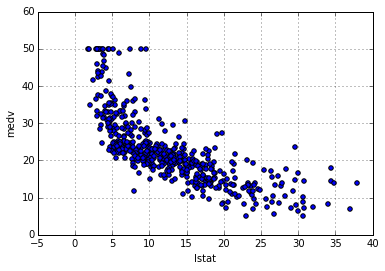

# Linear regression

## Libraries

Original ISLR lab loads `MASS` and `ISLR` libraries for the lab. `MASS` is a
large collection of datasets and functions and `ISLR` package includes data sets
associated with the book.

This lab uses `Boston` data set from `MASS` package. We can download the data
set here: https://archive.ics.uci.edu/ml/datasets/Housing. When you look at the
[data](https://archive.ics.uci.edu/ml/machine-learning-
databases/housing/housing.data)
you can see data doesn't contain the header, but we can use
[`housing.names`](https://archive.ics.uci.edu/ml/machine-learning-
databases/housing/housing.names)
for attribute information.

### Downloading manually

    import pandas as pd
    boston_url = "https://archive.ics.uci.edu/ml/machine-learning-databases/housing/housing.data"
    # The file is in fixed-width format
    boston = pd.read_fwf(boston_url, sep=None, header=None,
                         names=['crim', 'zn', 'indus', 'chas', 'nox', 'rm', 'age',
                                'dis', 'rad', 'tax', 'ptratio', 'b', 'lstat', 'medv'])

    boston.columns

    Index([u'crim', u'zn', u'indus', u'chas', u'nox', u'rm', u'age', u'dis', u'rad', u'tax', u'ptratio', u'b', u'lstat', u'medv'], dtype='object')

The description for each column is as follows.

1. crim      per capita crime rate by town
2. zn        proportion of residential land zoned for lots over 25,000 sq.ft.
3. indus     proportion of non-retail business acres per town
4. chas      Charles River dummy variable (= 1 if tract bounds river; 0
otherwise)
5. nox       nitric oxides concentration (parts per 10 million)
6. rm        average number of rooms per dwelling
7. age       proportion of owner-occupied units built prior to 1940
8. dis       weighted distances to five Boston employment centres
9. rad       index of accessibility to radial highways
10. tax      full-value property-tax rate per \$10,000
11. ptratio  pupil-teacher ratio by town
12. b        1000(Bk - 0.63)^2 where Bk is the proportion of blacks by town
13. lstat    % lower status of the population
14. medv     Median value of owner-occupied homes in $1000's

### Loading from scikit-learn module

It turns out `boston` data set is available in scikit-learn module.

    from sklearn.datasets import load_boston
    bos = load_boston()
    boston = pd.DataFrame(bos.data)
    boston.columns = [f.lower() for f in bos.feature_names]
    boston['medv'] = bos.target

## Linear regression

In this section we do simple linear regression with `medv` (median house) as the
response and `lstat` (percent lower status of the population) as the predictor.

    %matplotlib inline
    boston.plot(kind='scatter', x='lstat', y='medv')

    <matplotlib.axes._subplots.AxesSubplot at 0x7f8710e23b50>

### Linear regression with scikit-learn

There are different ways to perform linear regression using Python. Let's start
with usign scikit-learn.

    from sklearn import linear_model
    # Create the linear regression object
    regr = linear_model.LinearRegression()
    # Fit the model
    regr.fit(pd.DataFrame(boston.lstat), boston.medv)
    # print model parameters
    regr.coef_, regr.intercept_

    (array([-0.95004935]), 34.553840879383124)

### Linear regression with SciPy

We could also use `scipy.stats.linregress` to compute a least-squares
regression.

    from scipy import stats
    slope, intercept, r_value, p_value, std_err = stats.linregress(boston.lstat, boston.medv)

Now we can check out some basic information about the model. First, coeffficents

    slope, intercept

    (-0.9500493537579906, 34.553840879383131)

    r_value**2

    0.54414629758647892

    p_value

    5.0811033943898219e-88

    std_err

    0.038733416212639461

### Linear regression with `statsmodels`
